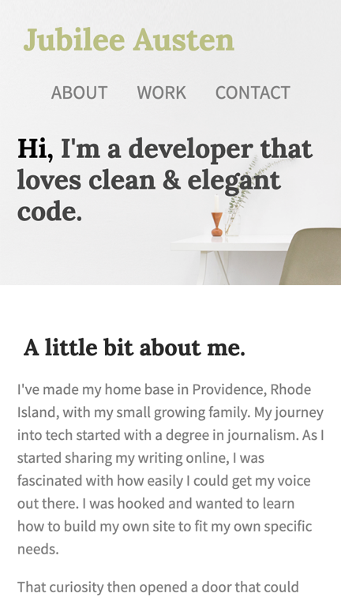
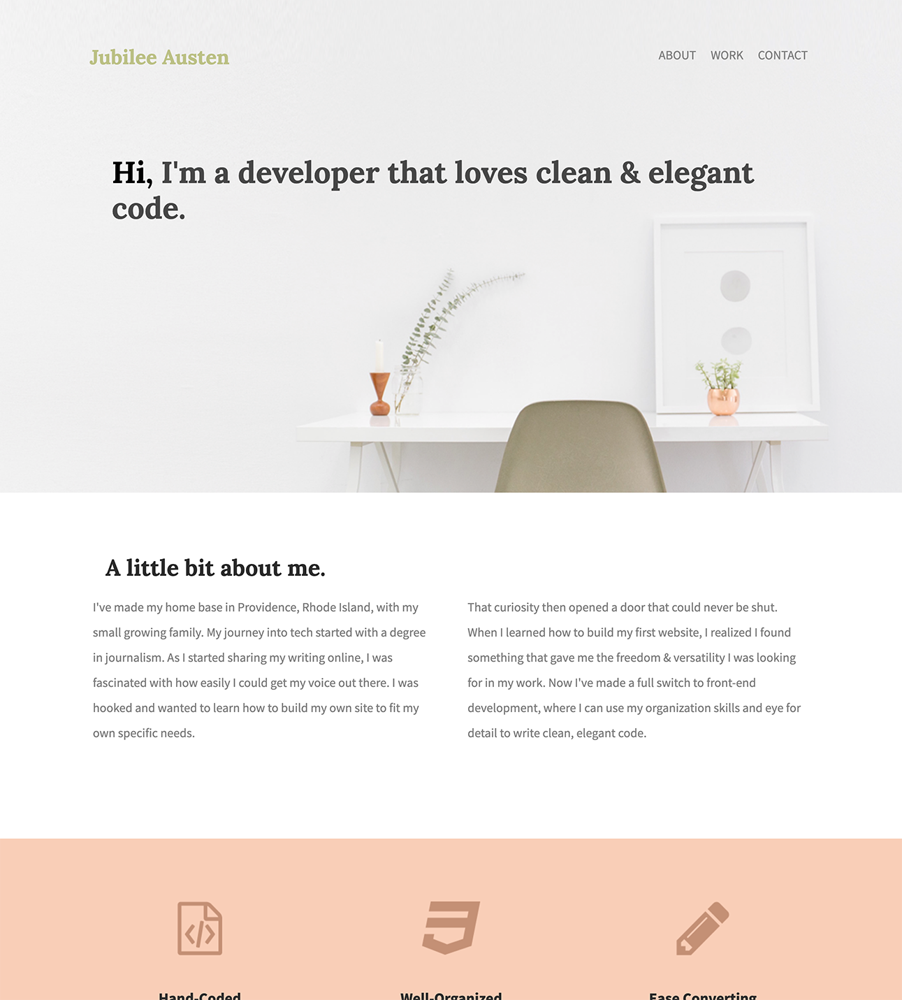

# jubilee-austen

[Deployed Page](https://mtorcellini.github.io/jubilee-austen/)

## Description
A simple, responsive, single-page website. Demonstrates use of HTML and CSS to produce a visually engaging page.

